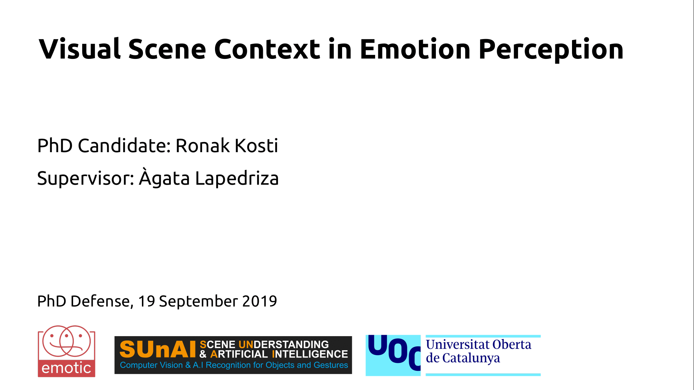

# Repository for EMOTIC (EMOTIon recognition in Context)
(Official Website: [EMOTIC](http://sunai.uoc.edu/emotic/index.html))

## ACCESS to EMOTIC 
**Note: EMOTIC dataset can be used only for non-commercial research and education purposes.**

Please, fill the following form to request access to the dataset and the corresponding annotations.

[Access Request for EMOTIC](https://forms.gle/aCLLPAiqP8WeVChbA)

## Watch a ~3 minute video (just me speaking, no presentations or anything) summarizing my thesis on this topic.
+ YouTube Link: [Read Thesis  in 4-Minutes](https://www.youtube.com/watch?v=D678cyrhTRQ)

## BENCHMARKS
[Benchmarks for Emotion Recognition in Context](https://paperswithcode.com/sota/emotion-recognition-in-context-on-emotic)

## Other related files 
+ Demo for computing the Average Precision (AP) [demoComputeAP](https://1drv.ms/u/s!AkYHbdGNmIVCgbYZB_dY3wuWJou_5A?e=jcsZUj)

+ Single Image Inference for PAMI version (input image and the corresponding bounding box info required): [Single Image Inference](https://github.com/rkosti/emotic/blob/master/src/single_image_inference.lua)

+ For Model architecture (same for cvpr and pami publications), you can refer [**emotic_cnn_model_structure.txt**](https://1drv.ms/t/s!AkYHbdGNmIVCgbYV2ymTghehKLdxBg?e=PMyGgc)

+ PyTorch implementation of EMOTIC [EMOTIC PyTorch](https://github.com/Tandon-A/emotic). Thanks to [Abhishek Tandon](https://github.com/Tandon-A)

## Cite us using our following publications
+ PAMI'19 paper: [Context Based Emotion Recognition using EMOTIC Dataset](https://ieeexplore.ieee.org/document/8713881)

+ CVPR'17 paper: [Emotion Recognition in Context](http://openaccess.thecvf.com/content_cvpr_2017/html/Kosti_Emotion_Recognition_in_CVPR_2017_paper.html)

+ CVPRW'17 paper: [EMOTIC: Emotions in Context Dataset](http://openaccess.thecvf.com/content_cvpr_2017_workshops/w41/html/Lapedriza_EMOTIC_Emotions_in_CVPR_2017_paper.html)

+ PhD Manuscript: [Visual Scene Context in Emotion Perception](https://www.tdx.cat/handle/10803/667808) _[much easier to read with broader set of experiments]_

## Slides/Overview of the Defense Talk

